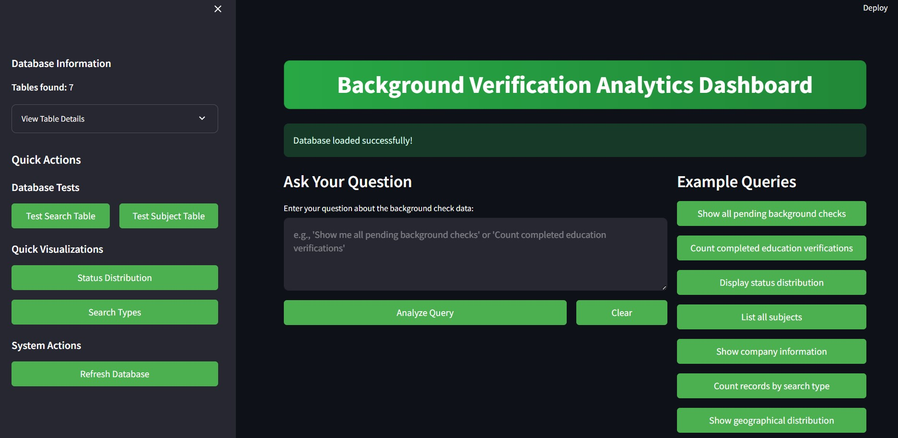
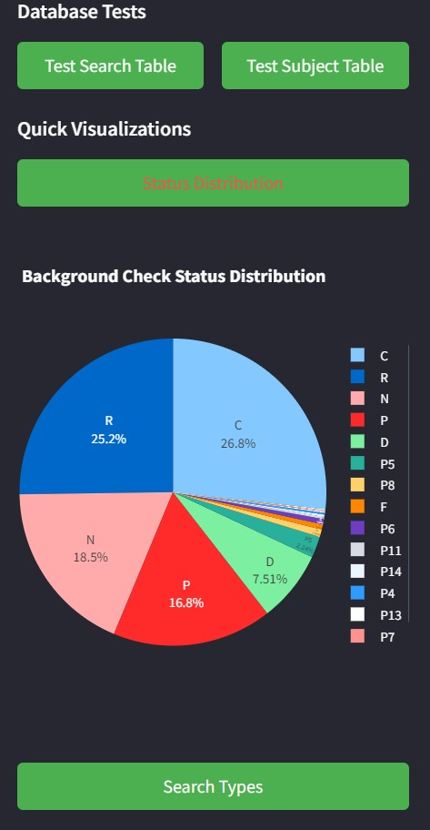
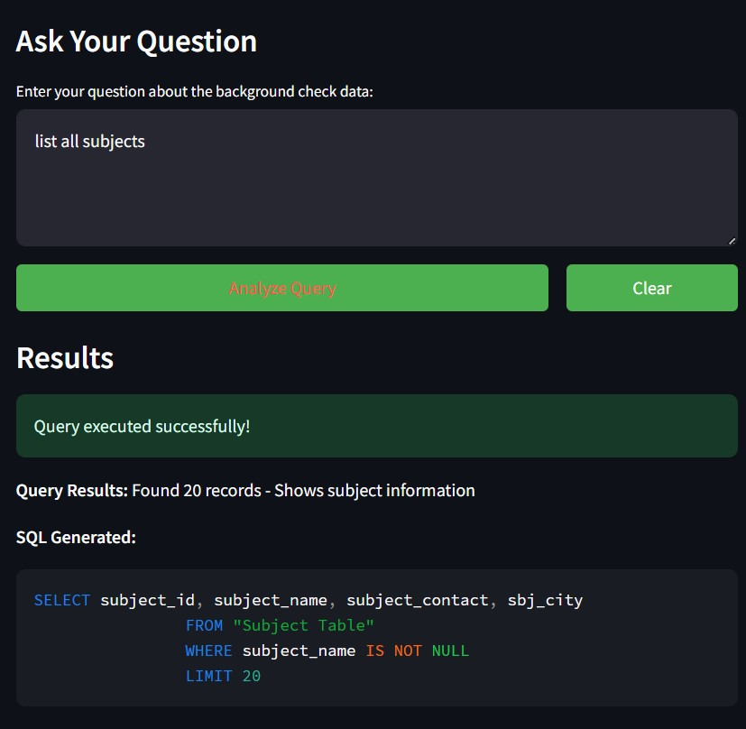
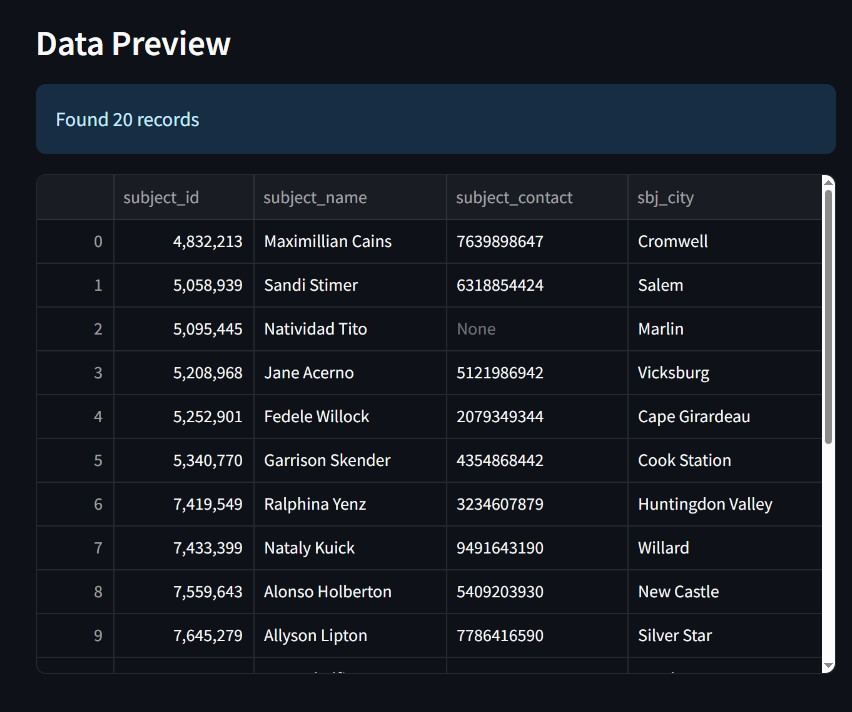
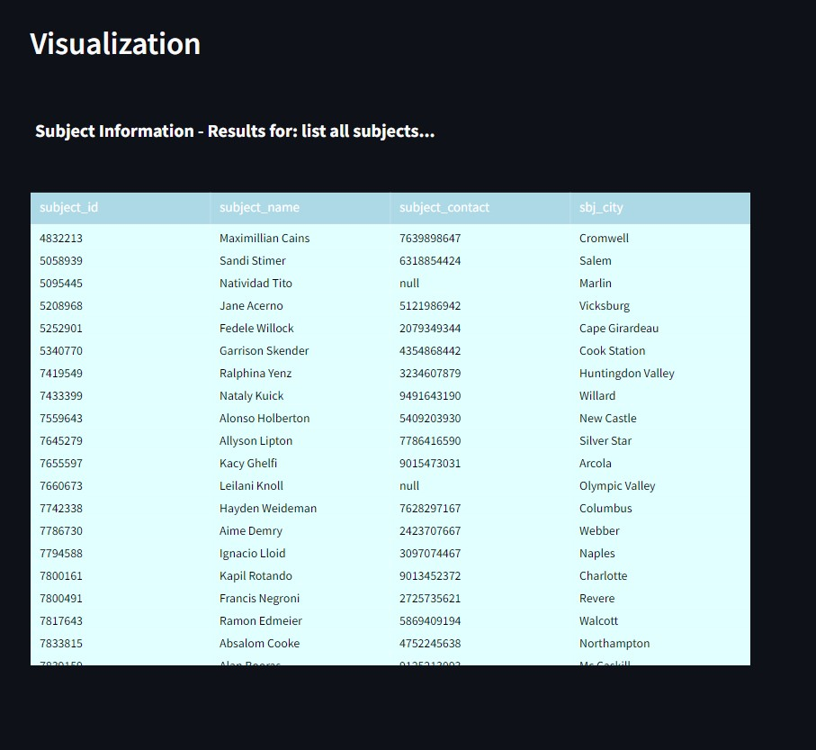

# Background Verification Analytics Dashboard

A comprehensive Streamlit-based analytics dashboard for background check data analysis with natural language query processing and automated visualizations.

## Overview

This dashboard provides an intelligent interface for analyzing background verification data through natural language queries. It automatically generates SQL queries, creates appropriate visualizations, and offers downloadable results.

## Screenshots

### Home Dashboard

Main dashboard interface with query input and navigation

Automatic chart generation and data insights

### Working Interface

Natural language query processing in action

Query results with data tables and export options

Advanced analytics and visualization features

## Features

- *Natural Language Processing*: Ask questions in plain English about your background check data
- *Automated SQL Generation*: Converts natural language to optimized SQL queries
- *Smart Visualizations*: Automatically selects the best chart type based on your data
- *Interactive Dashboard*: Real-time query processing with immediate results
- *Data Export*: Download results as CSV files
- *Security-First*: Built-in SQL injection protection and query validation
- *Multi-Table Support*: Handles complex joins across multiple data tables

## Quick Start

### Prerequisites

bash
pip install streamlit pandas plotly sqlalchemy openpyxl logging

### Installation

1. Clone or download the project files
2. Ensure your Excel file (DataSet_Hackathon.xlsx) is in the root directory
3. Run the application:

bash
streamlit run src/chatbot.py

### First Use

1. The dashboard will automatically load your Excel data into a SQLite database
2. Start asking questions about your data in the text area
3. View results, visualizations, and download data as needed

## Supported Query Types

### Status Queries
- "Show all pending background checks"
- "Count completed education verifications"
- "Display status distribution"

### Subject Information
- "List all subjects"
- "Show subject details"
- "Count unique subjects"

### Company Analysis
- "Show company information"
- "List Amazon related searches"
- "Display orders by company"

### Geographic Analysis
- "Show geographical distribution"
- "Count by state"

### Package & Pricing
- "Display package pricing"
- "Show package usage"

## Architecture

### Core Components

#### 1. Database Connection (database_connection.py)
- SQLite database management
- Excel file loading and validation
- Table creation and indexing
- Data cleaning and normalization

#### 2. LLM Query Engine (llm_setup.py)
- Natural language to SQL conversion
- Query pattern matching
- SQL validation and security checks
- Result formatting

#### 3. Data Visualizer (visualizations.py)
- Automatic chart type selection
- Interactive Plotly visualizations
- Multi-chart dashboards
- Export capabilities

#### 4. Main Chatbot Interface (chatbot.py)
- Streamlit web interface
- User input processing
- Result display and interaction
- File upload handling

### Data Processing Pipeline

Excel File → Database Loading → Query Processing → Visualization → Results Display
     ↓              ↓                ↓               ↓           ↓
File Validation  Table Creation  NLP→SQL         Chart Gen.   Download
Data Cleaning    Index Creation   Validation      Auto-select  Export
Schema Setup     Type Conversion  Execution       Styling      History

## Security Features

- *SQL Injection Protection*: Comprehensive keyword filtering and validation
- *Query Sanitization*: Safe parameter binding and input cleaning  
- *Access Control*: Read-only database operations
- *Input Validation*: Length limits and content filtering
- *Error Handling*: Graceful failure management

## Project Structure

background-verification-dashboard/
├── src/
│   ├── __init__.py
│   ├── chatbot.py              # Main Streamlit application
│   ├── database_connection.py  # Database management
│   ├── llm_setup.py            # Query processing engine
│   ├── visualizations.py       # Chart generation
│   └── utils.py                # Utility functions
├── tests/
│   ├── __init__.py
│   └── test_all.py             # Comprehensive test suite
├── utils/
│   ├── __init__.py
│   └── advanced_visualizations.py  # Advanced chart types
├── main.py                     # Application entry point
└── README.md

## Configuration

### Environment Variables
- EXCEL_FILE_PATH: Path to your Excel data file (default: DataSet_Hackathon.xlsx)

### Table Mapping
The system expects these Excel sheets:
- Search Table: Main background check records
- Subject Table: Subject/person information  
- Company Table: Company details
- Search_Type Table: Search type definitions
- Search_status: Status code mappings
- Package Table: Package pricing information
- Order_Request Table: Order requests

### Customization Options
- Modify query patterns in llm_setup.py
- Adjust visualization settings in visualizations.py
- Update security rules in database_connection.py

## Testing

Run the comprehensive test suite:

bash
python tests/test_all.py

### Test Coverage
- Database connectivity and operations
- Query engine functionality
- Visualization generation
- Excel file loading
- Error handling scenarios
- Security validation

## Visualization Types

### Automatic Selection
The system automatically chooses the best visualization based on your data:

- *Pie Charts*: Status distributions, categorical breakdowns
- *Bar Charts*: Company comparisons, type distributions
- *Geographic Maps*: State-based analysis
- *Scatter Plots*: Price vs usage analysis
- *Tables*: Detailed data views, subject information
- *Metrics*: Single value displays
- *Treemaps*: Hierarchical category data

### Interactive Features
- Hover tooltips with detailed information
- Clickable legends for filtering
- Zoom and pan capabilities
- Export options (PNG, PDF, HTML)

## Performance Optimization

- *Database Indexing*: Automatic index creation on key columns
- *Query Limiting*: Results capped at reasonable limits
- *Batch Processing*: Large dataset handling
- *Memory Management*: Efficient data loading
- *Caching*: Session-based result caching

## Error Handling

The system includes comprehensive error handling for:
- Invalid Excel file formats
- Missing data tables
- Malformed queries
- Database connection issues
- Visualization failures
- Memory constraints

## Contributing

### Development Setup
1. Install development dependencies
2. Run tests to ensure everything works
3. Make your changes
4. Test thoroughly
5. Submit your improvements

### Code Style
- Follow PEP 8 for Python code
- Add comprehensive logging
- Include error handling
- Write tests for new features
- Document complex functions

## Requirements

### System Requirements
- Python 3.7+
- 4GB+ RAM recommended
- Modern web browser

### Python Dependencies

streamlit>=1.28.0
pandas>=1.5.0
plotly>=5.15.0
sqlalchemy>=1.4.0
openpyxl>=3.0.0

## API Reference

### DatabaseConnector Class
python
db_connector = DatabaseConnector()
db_connector.load_excel_to_sql(file_path)
db_connector.test_query(table_name, limit=5)

### LLMQueryEngine Class
python
query_engine = LLMQueryEngine(database_engine)
response, sql, df = query_engine.query("natural language query")

### DataVisualizer Class
python
visualizer = DataVisualizer(database_engine)
fig = visualizer.auto_visualize(dataframe, title)

## Support

For issues, questions, or contributions:
1. Check the test suite for examples
2. Review the error logs for debugging
3. Ensure your Excel file matches the expected format
4. Verify all dependencies are installed correctly

## License

This project is provided as-is for educational and development purposes.

## Acknowledgments

Built with modern Python data science tools:
- *Streamlit* for the web interface
- *Pandas* for data manipulation
- *Plotly* for interactive visualizations
- *SQLAlchemy* for database operations

---

Background Verification Analytics Dashboard - Making data analysis accessible through natural language processing
